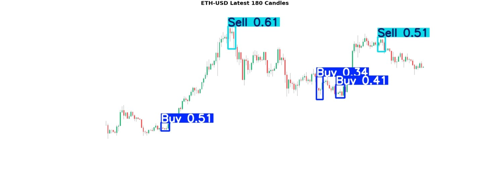

# BlockFinAI


## Overview
BlockFinAI is an advanced application designed for detecting patterns in stock and cryptocurrency charts using deep learning techniques. Inspired by the methodology detailed in the research article "[YOLO Object Recognition Algorithm and “Buy-Sell Decision” Model Over 2D Candlestick Charts](https://ieeexplore.ieee.org/document/9092995)" by Serdar Birogul, Günay Temür, and Utku Kose, this project extends that approach by implementing YOLOv8 and integrating it into a user-friendly Streamlit app. BlockFinAI automates chart pattern recognition to empower traders and analysts.

## About
BlockFinAI leverages the state-of-the-art YOLOv8 object detection algorithm to identify candlestick patterns and classify them as “Buy” or “Sell” signals. It provides traders with automated insights into trend directions, support/resistance levels, and specific price targets.



## Problem Statement
Accurate, real-time identification of chart patterns is crucial for profitable trading but is time-consuming and error-prone when done manually. BlockFinAI addresses this by analyzing candlestick charts automatically and delivering reliable pattern detection instantly.

## Data Collection & Annotation
1. **Data Download:** Candlestick data fetched via `yfinance`.
2. **Chart Generation:** Plots created using `mplfinance`.
3. **Annotation:** Patterns labeled using `Roboflow` to train the YOLOv8 model.


## BlockFinAI App
The BlockFinAI Streamlit app provides:
- **Intuitive UI:** Upload or generate charts for analysis.
- **Instant Results:** Real-time pattern detection.
- **High Accuracy:** Powered by YOLOv8.
- **Versatility:** Supports both stock and crypto charts.


### Getting Started
```bash
git clone https://github.com/YourOrg/BlockFinAI.git
cd BlockFinAI
pip install -r requirements.txt
streamlit run app.py
```

### Online Demo
Access the live demo: [BlockFinAI Streamlit App](https://blockfinai.streamlit.app)

## Scientific Foundation
Based on the research article "[YOLO Object Recognition Algorithm and “Buy-Sell Decision” Model Over 2D Candlestick Charts](https://ieeexplore.ieee.org/document/9092995)", BlockFinAI adopts best practices from the literature and integrates YOLOv8 for robust chart analysis.

## Disclaimer
**BlockFinAI is for educational and informational purposes only and does not constitute financial advice.** Traders should conduct their own research and consult professionals before making any trading decisions.

## Acknowledgments
Acknowledgments go to the authors of the original research article for their groundbreaking work, which served as the inspiration for this project. Additionally, thanks to the creators of the `yfinance`, `mplfinance`, and `Roboflow` tools for their invaluable resources. 

## Conclusion
BlockFinAI represents a significant advancement in the automated analysis of financial charts. By leveraging the latest in object detection technology and providing an accessible interface, it aims to empower traders and analysts with a powerful tool for making informed decisions.
